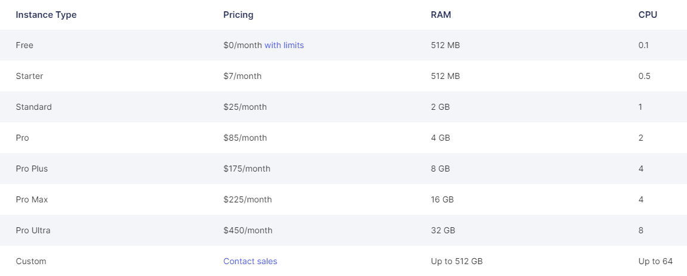

<h1 align="center">Renderprime</h1>

This project aims to be the fastest prerender server possible.
<br>
It leaverages caching and uses functional navigations to achieve unmatched performance, far exceeding tools like _[Prerender](https://github.com/prerender/prerender)_ and _[Rendertron](https://github.com/GoogleChrome/rendertron)_.

You only have to make sure that your app has no memory leaks and that memory doesn't build up through page navigations.

- [Environment Variables](#environment-variables)
- [Exposing The Navigation Function](#exposing-the-navigation-function)
- [Reloading on Update](#reloading-on-update)
- [Benchmarks](#benchmarks)

# Environment Variables

`CPUS`: The number of tabs to open. Each tab will operate in a different CPU core to ensure maximum performance (default: `numCPUs - 1`).

`PORT`: The port which the server will listen to (default: `8000`).

`RATE_LIMIT`: The maximum number of requests in the queue (default: `CPUS * 20`, so 20 requests per tab).

`USER_AGENT`: The `navigator.userAgent` string that will be injected to the browser during rendering (default: `Prerender`).

`WEBSITE_URL`: The website to render. Will be loaded to immediately in order to fetch and cache all assets.

`WAIT_AFTER_LAST_REQUEST`: The number of milliseconds to wait after the last request before snapshotting the DOM. This has tight correlation to the CPU power (default: `200`).

`WAIT_AFTER_LAST_REQUEST_TIMEOUT`: For how many milliseconds should the browser wait for the last request to return before giving up and snapshotting the DOM anyway (default: `5000`).

# Exposing The Navigation Function

In order to load pages quickly, our Single-Page Application shouldn't be reloaded upon each page request. Instead, the app should use its internal (functional) navigation, like it does for a real user.

We only need to expose a global navigation function called `navigateTo` and dispatch the `navigationend` event when a navigation finishes. Renderprime will do the rest for us.

This is the React 18 implementation:

_**hooks/useExposeNavigationFunction.ts**_

```js
import { useTransition, useRef, useEffect } from 'react'
import { useNavigate, To, NavigateOptions } from 'react-router-dom'

const useExposeNavigationFunction = () => {
  const [pending, startTransition] = useTransition()

  const navigate = useNavigate()

  const navigating = useRef(false)

  useEffect(() => {
    if (pending) navigating.current = true
    else if (navigating.current) {
      navigating.current = false

      window.dispatchEvent(new Event('navigationend'))
    }
  }, [pending])

  const transitionNavigate = (to: To, options?: NavigateOptions) => startTransition(() => navigate(to, options))

  window['navigateTo'] = (url: string) => transitionNavigate(url.replace(window.location.origin, ''), { replace: true })
}

export default useExposeNavigationFunction
```

_**App.tsx**_

```js
import useExposeNavigationFunction from 'hooks/useExposeNavigationFunction'

const App: FC<{}> = () => {
  useExposeNavigationFunction()

  return (
    ...
  )
}

export default App
```

It is important to use transitioning since this is the most accurate indication that a navigation has finished.

_Note that if you cannot utilize transitioning in your setup, you should look for other ways to tell when navigations end._

# Reloading on Update

Since Renderprime doesn't reload pages, our app won't be updated as long as the server runs.

To overcome this, Renderprime has a `/reload` endpoint that, when called, reloads all pages.
<br>
By doing so, new assets will be downloaded and our pages will be prerendered in the app's latest version.

It is recommended to add an HTTP call to this endpoint at the end of the CI/CD pipeline.

# Benchmarks

Here are the benchmarks of Renderprime deployed on _[Render](https://render.com)_ while rendering random Pokemon pages from my _[Client-side Rendering](https://client-side-rendering.pages.dev/pokemon)_ app.



Each test opens 1 tab per CPU core (except when the amount on RAM is the bottleneck).
<br>
Values indicate the average time it took for the last request to return when requesting **100 pages concurrently**.

| Instance Type      | Seconds |
| ------------------ | ------- |
| Free (1 tab)       | 82.1    |
| Starter (5 tabs)   | 14.33   |
| Standard (15 tabs) | 6.54    |

From the above results, considering the pricing, it's clear that the best option is to run multiple _Starter_ instances and load-balance between them.
